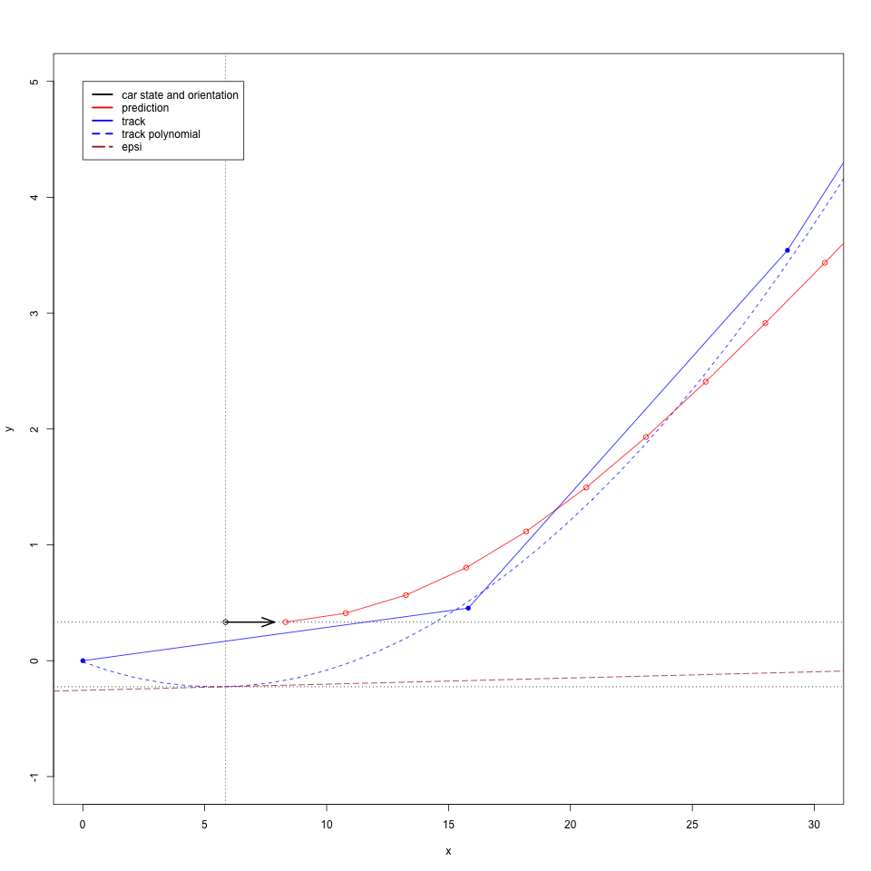
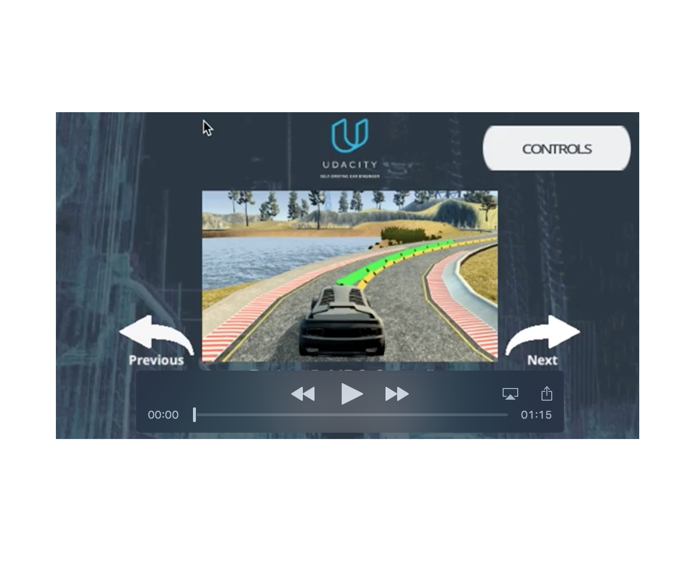

# Model-Predcitve-Control
5th project of the 2nd term in Udacities Self Driving Car Course

## Problem Description

The task is to keep a car safely on a given track in a simulator, controlling the steering angle - within the range [-25°, 25°] - and the throttle - within [-1, 1] - with a [MPC algorithm](https://en.wikipedia.org/wiki/Model_predictive_control). 

The state measurements supported by the simulator are: 
- Global car position "px" and "py" in meters.
- A list of 6 way point coordinates nearby the car (one behind and five in front of the current car position).
- The orientation of the car within the global map "psi" in rad.
- The current speed "v" in mph.

Furthermore a latency of 100 ms has been added to mimic real driving conditions.

## Overview

For MPC the way points and the vehicle position within the global coordinate system are transformed in the "MPC space".
In "MPC space" the first way point given by the simulator represent the center of the coordinate system. All translated points are rotated by -psi. The resulted space is shown in the picture below.

The black circle represent the car positions within the space. The black arrow shows its orientation which is always 0°.
The blue line represents the connection within the given way points. The dashed blue line shows the 3rd order polynomial fit for the given way points. The distance between the two dotted horizontal lines is the cross track error. The angle of the brown tangent represents the psi error.

The so transformed and calculated values together with the current speed in m/s are passed as the state to the MPC solve method.
```
Eigen::VectorXd state(6);
state << car_rel_x, car_rel_y, 0, v, cte, epsi;
//Calculate steering angle and throttle from current state using MPC.
auto vars = mpc.Solve(state, coeffs);
```

The calculated throttle and steering angle are used as the control values for the simulated car.
The red line in the graph above represents the results as prediction path for the next N time stamps. 

To achieve a reasonable accurate prediction model the time per cycle is measured and the last elapsed time is used for the model parameter "dt". For a real time system with defined time slices a fixed value could be used.
For tests only the lowest resolution of the simulator with lowest graphic details was used, resulting - togehter with the latency of 100 ms - in a cycle time of around 130 ms. Together with the number of predictions "N" set to 12 the prediction horizon results in ~1,5 seconds and stays (almost ever) behind the path sector given by the way points. For higher resolutions - depending on the test machine - the cycle time may increase and the prediction horizon shall be adapted by decreasing parameter "N".

The cost is calculated as follows:

```
// The part of the cost based on the reference state.
for (int t = 0; t < N; t++) {
  cost = cte_eval_weigth*CppAD::pow(vars[cte_start + t], 2); //Cross track errors
  cost += CppAD::pow(vars[epsi_start + t], 2); //error psi
  cost += CppAD::pow(vars[v_start + t] - (ref_v*ref_v_correction), 2); // speed
}

// Minimize the use of actuators according to velocity.
for (int t = 0; t < N - 1; t++) {
  cost += delta_eval_weigth*CppAD::pow(vars[delta_start + t], 2)*CppAD::pow(vars[v_start + t], 3);
  cost += CppAD::pow(vars[a_start + t], 2);
}

// Minimize the value gap between sequential actuations.
for (int t = 0; t < N - 2; t++) {
  cost += delta_diff_eval_weigth*CppAD::pow(vars[delta_start + t + 1] - vars[delta_start + t], 2);
  cost += CppAD::pow(vars[a_start + t + 1] - vars[a_start + t], 2);
}
```
For the cost calculation of CTE, delta values and difference of delta values weight parameters have been added.
```
// The reference velocity is set to 40 mph.
double ref_v = 40*MPH_TO_MS;

//The weights for cost evaluation
CppAD::AD<double> cte_eval_weigth = 5.0;
CppAD::AD<double> delta_eval_weigth = 0.02494*ref_v-0.200000; //Workaround. -> Best delta cost calc has not been found yet.
CppAD::AD<double> delta_diff_eval_weigth = 1000.0;
```
With the weights shown in the snippet above, the car shows an acceptable driving behavior for reference speeds between 40 and 100 mph. The delta_eval_weigth has to be set to different values depending on the reference speed, this indicates that the best way to calculate the cost for delta values has not been found yet and would need some more analysis. 

## Results

The driving behavior for 40 mph and 100 mph reference speed is shown in the two videos below.

[](./img/MPC_40mph.mp4)
[](./img/MPC_100mph.mp4)

## Dependencies

* cmake >= 3.5
 * All OSes: [click here for installation instructions](https://cmake.org/install/)
* make >= 4.1
  * Linux: make is installed by default on most Linux distros
  * Mac: [install Xcode command line tools to get make](https://developer.apple.com/xcode/features/)
  * Windows: [Click here for installation instructions](http://gnuwin32.sourceforge.net/packages/make.htm)
* gcc/g++ >= 5.4
  * Linux: gcc / g++ is installed by default on most Linux distros
  * Mac: same deal as make - [install Xcode command line tools]((https://developer.apple.com/xcode/features/)
  * Windows: recommend using [MinGW](http://www.mingw.org/)
* [uWebSockets](https://github.com/uWebSockets/uWebSockets)
  * Run either `install-mac.sh` or `install-ubuntu.sh`.
  * If you install from source, checkout to commit `e94b6e1`, i.e.
    ```
    git clone https://github.com/uWebSockets/uWebSockets 
    cd uWebSockets
    git checkout e94b6e1
    ```
    Some function signatures have changed in v0.14.x. See [this PR](https://github.com/udacity/CarND-MPC-Project/pull/3) for more details.
* Fortran Compiler
  * Mac: `brew install gcc` (might not be required)
  * Linux: `sudo apt-get install gfortran`. Additionall you have also have to install gcc and g++, `sudo apt-get install gcc g++`. Look in [this Dockerfile](https://github.com/udacity/CarND-MPC-Quizzes/blob/master/Dockerfile) for more info.
* [Ipopt](https://projects.coin-or.org/Ipopt)
  * Mac: `brew install ipopt`
  * Linux
    * You will need a version of Ipopt 3.12.1 or higher. The version available through `apt-get` is 3.11.x. If you can get that version to work great but if not there's a script `install_ipopt.sh` that will install Ipopt. You just need to download the source from the Ipopt [releases page](https://www.coin-or.org/download/source/Ipopt/) or the [Github releases](https://github.com/coin-or/Ipopt/releases) page.
    * Then call `install_ipopt.sh` with the source directory as the first argument, ex: `bash install_ipopt.sh Ipopt-3.12.1`. 
  * Windows: TODO. If you can use the Linux subsystem and follow the Linux instructions.
* [CppAD](https://www.coin-or.org/CppAD/)
  * Mac: `brew install cppad`
  * Linux `sudo apt-get install cppad` or equivalent.
  * Windows: TODO. If you can use the Linux subsystem and follow the Linux instructions.
* [Eigen](http://eigen.tuxfamily.org/index.php?title=Main_Page). This is already part of the repo so you shouldn't have to worry about it.
* Simulator. You can download these from the [releases tab](https://github.com/udacity/self-driving-car-sim/releases).
* Not a dependency but read the [DATA.md](./DATA.md) for a description of the data sent back from the simulator.

## Basic Build Instructions

1. Clone this repo.
2. Make a build directory: `mkdir build && cd build`
3. Compile: `cmake .. && make`
4. Run it: `./mpc`.
